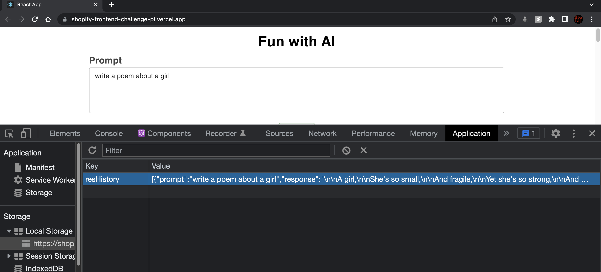
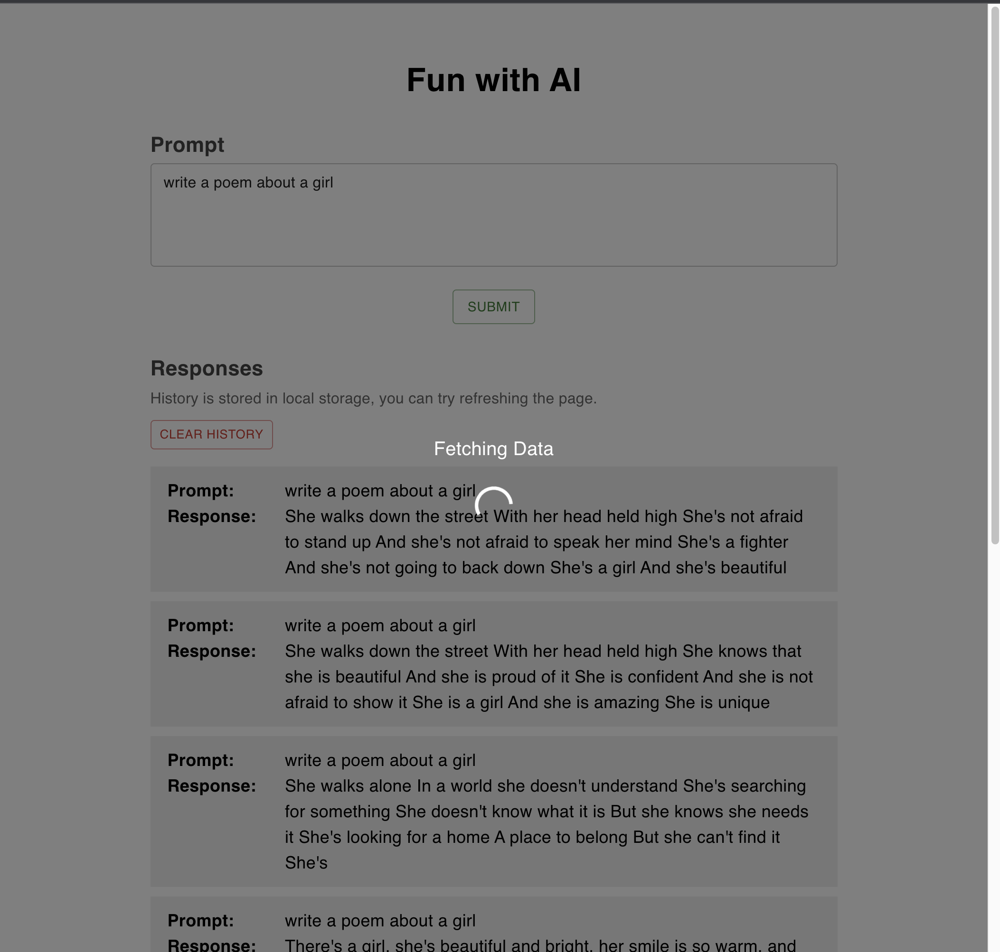
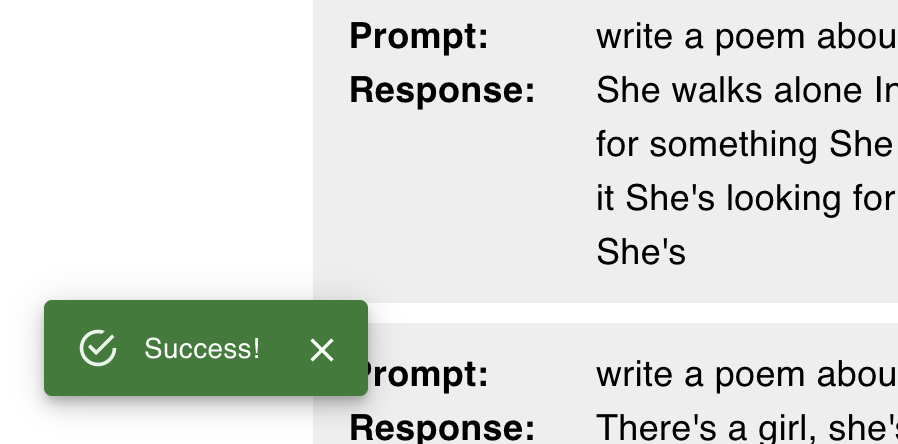
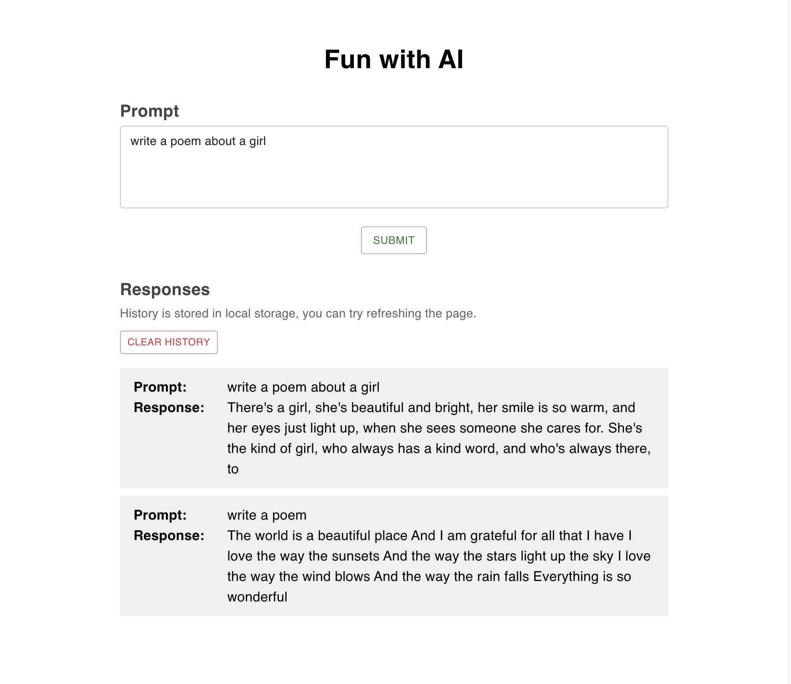

# Shopify Front-end Challenge

https://shopify-frontend-challenge-pi.vercel.app/

## Technology

React, MUI components, react-icons, formik, yup, local storage

Hooks: useState, useEffect, useContext

## Features
- Allow users to enter a prompt to get results from OpenAI's completions API.
- History is stored in local storage.

- Display a global backdrop when the form is submitting.

- Display a snackbar when the result is feteched form api.

## Screenshots

